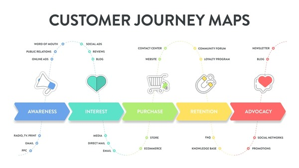

# 365’s Online Subscription-Based Learning Platform: User Behavior Analysis

## Table of Contents
1. [Executive Summary](#executive-summary)
2. [Objectives](#objectives)
3. [Introduction](#introduction)
4. [Data Dictionary](#data-dictionary)
5. [Analysis](#analysis)
   - [User Journey Insights](#1-user-journey-insights)
   - [Start Points and End Points](#2-start-points-and-end-points)
   - [Conversion Paths](#3-conversion-paths)
   - [Subscription Type Analysis](#4-subscription-type-analysis)
   - [Feature Importance for Conversion](#5-feature-importance-for-conversion)
   - [Drop-Off Points](#6-drop-off-points)
   - [Summary of Converted vs. Non-Converted Users](#7-summary-of-converted-vs-non-converted-users)
6. [Recommendations](#recommendations)
7. [Limitations](#limitations)
8. [Further Studies](#further-studies)
9. [Conclusion](#conclusion)

---

## Executive Summary

This analysis explores user behavior on 365’s subscription-based learning platform to identify opportunities for enhancing conversion rates, reducing drop-offs, and improving retention. Key findings include:

- **Repeat Usage**: A significant portion of sessions begin and end with "Log in," indicating strong repeat usage but also missed opportunities for deeper engagement.
- **Conversion Drivers**: Interactions with coupons and checkout pages are major drivers of conversions, highlighting the effectiveness of promotional offers.
- **Drop-Off Points**: Sessions frequently terminate at informational pages like "Blog" or "Resources center," suggesting a need for better transitions to action-oriented content.
- **Subscription-Specific Behaviors**: Annual subscribers engage more deeply with discounts, while monthly and quarterly subscribers exhibit shorter, direct engagement patterns.

Based on these insights, recommendations focus on optimizing login and homepage experiences, enhancing the pricing page, leveraging coupons and promotions, addressing drop-offs from informational pages, tailoring strategies for different subscription types, and improving the conversion journey for non-converting users.

---

## Objectives

The primary objective of this analysis is to explore user behavior on 365’s online subscription-based learning platform. By examining the user journey across various touchpoints, we aim to uncover insights that can guide strategies to enhance conversion rates, reduce user drop-off, and ultimately improve user retention. This analysis focuses on key user interactions, conversion paths, and drop-off points.

---

## Introduction

Analyzing user behavior is essential for understanding how users engage with the platform and identifying opportunities for improvement. This project examines user journeys, starting from the homepage and leading to key conversion events such as sign-up, log-in, and checkout. We also evaluate non-converting user behavior to identify drop-off points and obstacles that may prevent users from progressing to conversion. The goal is to provide actionable insights to improve platform navigation, optimize conversion paths, and reduce churn.

---

## Data Dictionary

- **user_id**: Unique identifier for each user on the platform.
- **session_id**: Unique identifier for each user session.
- **subscription_type**: The type of subscription the user holds (Annual, Monthly, Quarterly).
- **user_journey**: A sequence of pages visited by the user during their session.

The dataset contains 9,935 rows and 4 columns.

---

## Analysis

### 1. **User Journey Insights**

Top Interactions:
- The most frequent interaction across the platform is logging in, followed by accessing the homepage and checkout.
- | Step       | Count  |
  |------------|--------|
  | Log in     | 3,798  |
  | Homepage   | 2,396  |
  | Checkout   | 2,021  |
  | Sign up    | 1,210  |
  | Coupon     | 1,041  |

Login Dominance:
- The "Log in" step appears in both start and end points of the user journeys, suggesting repeat sessions without progressing beyond basic engagement.

### 2. **Start Points and End Points**

Start Points:
- Most sessions begin with users logging in or landing on the homepage.
- | Start Point | Count  |
  |-------------|--------|
  | Log in      | 2,379  |
  | Homepage    | 2,329  |
  | Checkout    | 1,776  |

End Points:
- Sessions tend to terminate either at the checkout or login page.
- | End Point   | Count  |
  |-------------|--------|
  | Log in      | 3,601  |
  | Checkout    | 1,964  |
  | Coupon      | 1,029  |
  | Sign up     | 883    |

Non-Converting Users:
- A large number of non-converting users terminate at the "Log in" or "Homepage" steps without progressing to conversion actions.

### 3. **Conversion Paths**

Top 5 Conversion Paths:
- Users who convert most often do so after visiting the checkout page directly.
- | Conversion Path            | Count  |
  |----------------------------|--------|
  | Checkout                   | 1,773  |
  | Pricing → Checkout         | 72     |
  | Homepage → Pricing → Checkout | 68     |
  | Courses → Pricing → Checkout | 7      |
  | Other → Pricing → Checkout | 3      |

Coupon Influence:
- Coupon usage contributes significantly to conversions.

### 4. **Subscription Type Analysis**

- **Annual Subscribers**: Engage more frequently with the "Log in" and "Coupon" steps, indicating loyalty and recurring discount usage.
- **Monthly and Quarterly Subscribers**: Exhibit shorter, direct engagement patterns, often navigating directly to checkout.

### 5. **Feature Importance for Conversion**

Key Drivers:
- Visits to the "Log in" page, followed by interactions with the "Other" and "Coupon" pages.
- | Feature           | Importance  |
  |-------------------|-------------|
  | visited_Log in    | 0.279290    |
  | visited_Other     | 0.201344    |
  | visited_Coupon    | 0.190997    |

### 6. **Drop-Off Points**

Drop-Off on Blog:
- Sessions terminating at the blog page reflect disengagement. Clear calls-to-action or product recommendations could address this issue.

### 7. **Summary of Converted vs. Non-Converted Users**

Converting Users:
- Tend to have shorter journeys with focused interactions on high-value pages like checkout and pricing.

Non-Converting Users:
- Often bounce after engaging with low-value or exploratory pages.

---

## Recommendations

1. **Optimize Login and Homepage Experiences**:
   - Implement personalized recommendations or notifications upon login to guide users toward meaningful actions.

2. **Enhance Pricing Page**:
   - Make the pricing page more visible and appealing with clearer value propositions or promotions.

3. **Leverage Coupons and Promotions**:
   - Expand targeted promotional campaigns and offer personalized discounts to encourage more users to proceed to checkout.

4. **Address Drop-Offs from Informational Pages**:
   - Add clear calls-to-action or embed product recommendations within blog posts to guide users toward higher-value pages.

5. **Tailored Strategies for Different Subscription Types**:
   - Offer subscription-specific retention strategies, such as renewal incentives or exclusive content, to reduce churn.

6. **Improve Conversion Journey for Non-Converting Users**:
   - Engage non-converting users with personalized content and reminders earlier in their sessions to drive higher conversions.

---

## Limitations

1. **Limited Session Length Data**:
   - No clear indication of how long users spend in each session, making it difficult to analyze engagement time.

2. **Lack of Demographic Information**:
   - No demographic data (e.g., age, location, gender) to tailor recommendations based on user profiles.

3. **Generalized User Journey Paths**:
   - No differentiation between new and returning users, which could affect behavior pattern analysis.

---

## Further Studies

1. **Session Duration Analysis**:
   - Include session duration to better understand the correlation between time spent on the platform and conversion likelihood.

2. **Demographic Analysis**:
   - Add demographic data to provide deeper insights into how different user segments behave and convert.

3. **Behavioral Segmentation**:
   - Segment users based on behavioral patterns (e.g., frequently returning users vs. one-time visitors) to identify precise engagement strategies.

---

## Conclusion

The analysis reveals key insights into user behavior, conversion paths, and drop-off points on 365’s subscription-based learning platform. By optimizing user journeys, enhancing the pricing page, leveraging promotional offers, addressing drop-offs from informational pages, and tailoring strategies for different subscription types, 365 can increase its conversion rates and reduce user churn. Incorporating session duration and demographic data into future analyses could yield even more actionable insights.
